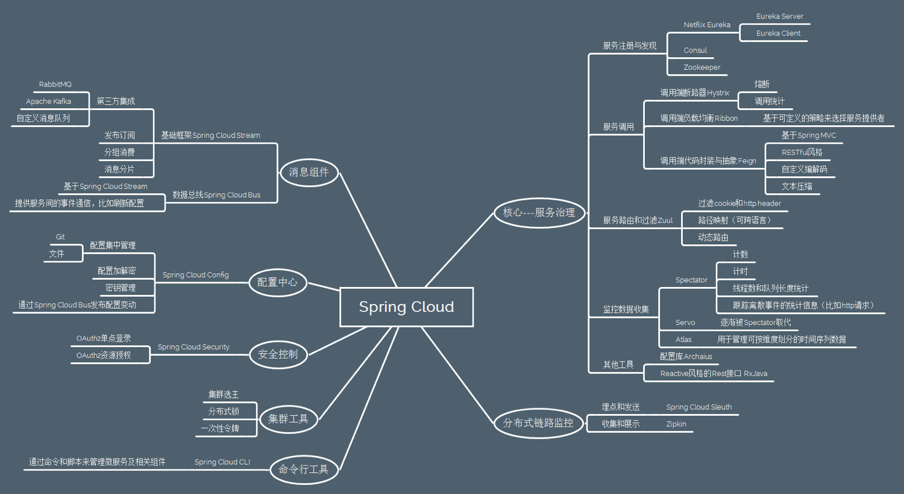

Spring Cloud Demo
--

## 一、Spring Cloud

它并没有重复制造轮子，它只是将目前各家公司开发的比较成熟、经得起实际考验的服务框架组合起来，
Spring Cloud是一系列框架的有序集合，是一个基于Spring Boot实现的云应用开发工具， 它利用Spring Boot的开发便利性巧妙地简化了分布式系统基础设施的开发，
如服务发现注册、配置中心、消息总线、负载均衡、断路器、数据监控等，都可以用Spring Boot的开发风格做到一键启动和部署。
通过Spring Boot风格进行再封装屏蔽掉了复杂的配置和实现原理，最终给开发者留出了一套简单易懂、易部署和易维护的分布式系统开发工具包。

---
## 二、 Spring Cloud 的组件

Spring Cloud包含了多个子项目（针对分布式系统中涉及的多个不同开源产品，有近20个之多），比如：
* Spring Cloud Config
* Spring Cloud Netflix
    * Netflix Eureka - 服务注册和服务发现
    * Netflix Hystrix - 监控和断路器
    * Netflix Zuul - 动态路由网关
    * Netflix Archaius - 分布式配置管理
    * Netflix OSS Ribbon - 云端负载均衡
    * Netflix Feign - 声明式、模板化的HTTP客户端
    * Netflix Turbine - 监控聚合
* Spring Cloud Bus - 事件、消息总线, 可与Spring Cloud Config联合实现热部署
* Spring Cloud Sleuth - 日志收集工具包
* Spring Cloud Consul - 封装了Consul操作
* Spring Cloud Zookeeper - 操作Zookeeper的工具包
* Spring Cloud Cluster - 提供Leadership选举
* Spring Cloud Stream - 数据流操作开发包
* Spring Cloud Task - 提供云端计划任务管理、任务调度
* Spring Cloud Connectors - 便于云端应用程序在各种PaaS平台连接到后端
* Spring Cloud for Cloud Foundry - 通过Oauth2协议绑定服务到CloudFoundry
* Spring Cloud Data Flow - 大数据操作工具
* Spring Cloud Security - 基于spring security的安全工具包
* Spring Cloud Starters - 为Spring Cloud提供开箱即用的依赖管理
* Spring Cloud CLI - 快速建立云组件

更多详情可以参考[Spring Cloud中文网](https://springcloud.cc/)

---
## 三、相关Demo
* [config](https://github.com/zhangyuyu/Spring-Cloud/blob/master/config/README.md)
* [consul](https://github.com/zhangyuyu/Spring-Cloud/blob/master/consul/README.md)
* [hystrix](https://github.com/zhangyuyu/Spring-Cloud/blob/master/hystrix/README.md)
* [zipkin](https://github.com/zhangyuyu/Spring-Cloud/blob/master/zipkin/README.md)
* [micro-service](https://github.com/zhangyuyu/Spring-Cloud/blob/master/micro-service/README.md)
该Demo是基于consul在dokcer上搭建的应用。

---
## 四、References
* [Spring Cloud中文网](https://springcloud.cc/)
* [Josh Long 现场演示Spring Cloud Demo](http://ugcdl.video.gtimg.com/flv/238/116/w0509bebaly.m701.mp4?vkey=9A6D2D4E39215F32425133EE6CBDD4E20A2EA53AE98882B0629D3EACE36CFC5011F3AA378493B3DE1A9B542916090E64E5EC3CB532C718016F2F2C0D489D774525E4C10EAAB09BDB9B741CAE74FC15F8F6C8D3F37870E05D&amp;br=29&amp;platform=2&amp;fmt=auto&amp;level=0&amp;sdtfrom=v1010&amp;guid=45c3ae4bbff5383c0515108875534e0e)
* [大话Spring Cloud](http://www.ityouknow.com/springcloud/2017/05/01/simple-springcloud.html)
* [Spring Cloud基础教程](http://blog.didispace.com/Spring-Cloud%E5%9F%BA%E7%A1%80%E6%95%99%E7%A8%8B/)
* [Spring Cloud技术分析](http://tech.lede.com/2017/03/15/rd/server/SpringCloud0/)
