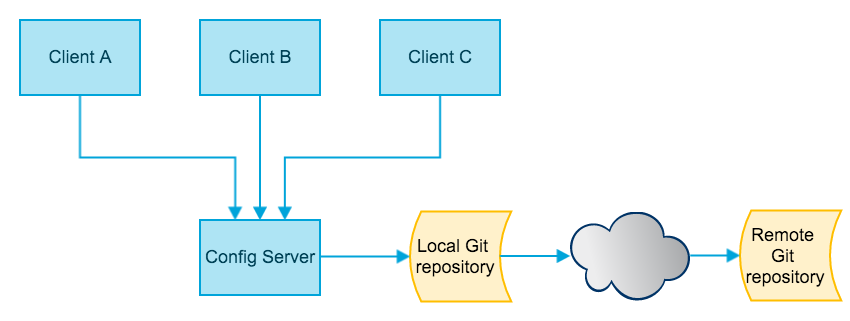

Spring Cloud Config Demo
--

Spring Cloud Config为分布式系统中的外部配置提供服务器和客户端支持。



## 一、启动
1. 启动config-server
`./gradlew clean bootRun`
2. 浏览器查看配置文件
`http://localhost:8888/config-client/dev`
3. 启动config-client
`./gradlew clean bootRun`
4. 浏览器访问config-client
`http://localhost:8881/config-client/wanzi`

## 二、刷新配置
1. `config-client`的`build.gradle`中新增`spring-boot-starter-actuator`监控模块，其中包含了`/refresh`刷新API。
2. `config-client`的Controller中新增`@RefreshScope`注解
3. `config-client`的`bootstrap.properties`文件新增`management.security.enabled=false`，使我们能够访问`/refresh`
3. 启动config-server，查看配置文件
4. 启动config-client，访问应用
5. 修改`config-client-dev.properties`内容，并提交
6. 刷新`http://localhost:8888/config-client/dev`，可看到server端的配置文件内容已经修改
7. 再次访问config-client，可以看到client端的内容并没有修改
8. 发送curl -X POST http://localhost:8881/config-client/refresh，可以看到返回了`["info.description"]`
9. 再次访问config-client，可以看到client端的内容已经更新

## 三、关于配置文件:

### 配置文件在本地的时候
1. 在`${HOME}/Documents/spring-cloud`目录下，放置了两个配置文件`application.properties`和`config-client.properties`
2. 将配置文件所在目录`${HOME}/Documents/spring-cloud`声明为git仓库
3. 并将配置文件`application.properties`和`config-client.properties`添加至git
4. spring.cloud.config.server.git.uri=file://${HOME}/Documents/spring-cloud
```
cd $HOME/Documents/spring-cloud
git init .
echo info.description = This is from local application properties file. > application.properties
echo info.description = This is from local config client dev properties file. > config-client-dev.properties
git add 

```

## 配置文件在remote git仓库时候
spring.cloud.config.server.git.uri=https://github.com/zhangyuyu/Spring-Cloud

