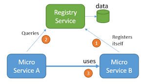
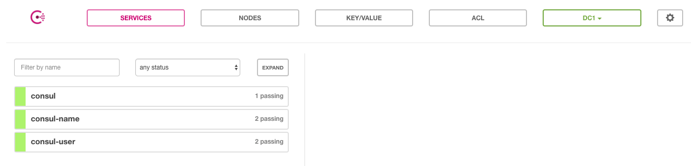

Spring Cloud Consul Demo
--

Spring Cloud Consul项目是针对Consul的服务治理实现。

Consul是一个分布式高可用的系统，它包含多个组件，但是作为一个整体，在微服务架构中为我们的基础设施提供服务发现和服务配置的工具。它包含了下面几个特性：

- 服务发现
- 健康检查
- Key/Value存储
- 多数据中心

由于Spring Cloud Consul项目的实现，我们可以轻松的将基于Spring Boot的微服务应用注册到Consul上，并通过此实现微服务架构中的服务治理。
另外，由于Consul自身提供了服务端，所以我们不需要像实现Eureka的时候创建服务注册中心，直接通过下载客户端，并使用`consul agent -dev`启动开发模式的Consul服务端程序就可以直接使用：

## 启动
1. 启动consul
`consul agent -dev`
2. 启动`consul-name` service
`./gradlew clean bootRun`
3. 启动`consul-user` service
`./gradlew clean bootRun`
4. 浏览器访问consul UI
`http://localhost:8500/ui/#/dc1/services`

5. 浏览器访问`consul-user` service，可以看到`consul-user`调用了`consul-name`
`http://localhost:8503/wanzi?mobile=12345`

## Feign
Feign是一个声明式的Web Service客户端，它使得编写Web Servce客户端变得更加简单。
我们只需要使用Feign来创建一个接口并用注解来配置它既可完成。它具备可插拔的注解支持，包括Feign注解和JAX-RS注解。Feign也支持可插拔的编码器和解码器。

Spring Cloud为Feign增加了对Spring MVC注解的支持，还整合了Ribbon和Eureka来提供均衡负载的HTTP客户端实现。

Spring cloud有两种调用方式，一种是ribbon+restTemplate，另一种是feign。Feign已经集成了Ribbon，因此，如果你已经使用@FeignClient那么，你可以直接使用Ribbon。

## Reference
* [Consul架构](http://zhangyuyu.github.io/2016/04/27/%E5%BE%AE%E6%9C%8D%E5%8A%A1-consul%E6%9E%B6%E6%9E%84/)
* [微服务-服务注册与发现](http://zhangyuyu.github.io/2016/04/18/%E5%BE%AE%E6%9C%8D%E5%8A%A1-%E6%9C%8D%E5%8A%A1%E6%B3%A8%E5%86%8C%E4%B8%8E%E5%8F%91%E7%8E%B0/)
 
