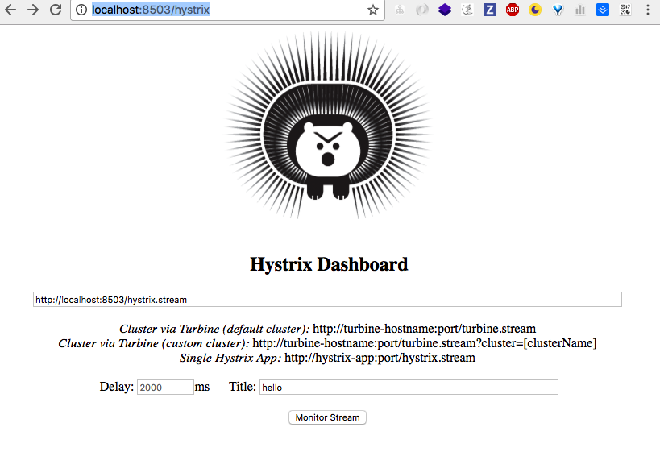
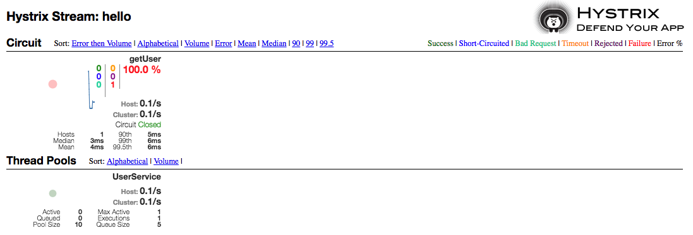

Spring Cloud Hystrix Demo
--
Hystrix是Netflix开源的微服务框架套件之一，该框架目标在于通过控制那些访问远程系统、服务和第三方库的节点，从而对延迟和故障提供更强大的容错能力。Hystrix具备拥有回退机制和断路器功能的线程和信号隔离，请求缓存和请求打包，以及监控和配置等功能。

## 启动
1. 启动consul
`consul agent -dev`
2. 启动`name-service` service
`./gradlew clean bootRun`
3. 启动`user-service` service
`./gradlew clean bootRun`
4. 浏览器访问consul UI
`http://localhost:8500/ui/#/dc1/services`
5. 浏览器访问`name-service`
`http://localhost:8502/wanzi?name=yu`
6. 浏览器访问`user-service`
`http://localhost:8503/wanzi?mobile=12345`
可以看到`Hi ,I'm Yu. My mobile is 12345`
7. 断开`name-service`
8. 浏览器访问`name-service`
可以看到`This site can’t be reached`
9. 浏览器访问`user-service`
可以看到`Sorry, error from name service.`

## Ribbon中引入Hystrix
启动`user-service`时候，使用`user-service-ribbon`
1. 添加hystrix依赖`compile('org.springframework.cloud:spring-cloud-starter-hystrix')`
2. @EnableHystrix
3. 使用`@HystrixCommand(fallbackMethod = "getNameError")`

## Feign使用Hystrix
注意这里说的是*使用*，没有错，我们不需要在Feigh工程中*引入*Hystix，Feign中已经依赖了Hystrix.
启动`user-service`时候，使用`user-service-feign`
1. 不需要额外添加hystrix依赖
2. 不需要额外@EnableHystrix
3. 直接在@FeignClient上添加fallback的类，该类实现标注@FeignClient的接口。
4. feign.hystrix.enabled = true

## 使用Hystrix Dashboard
1. 添加依赖
* compile('org.springframework.cloud:spring-cloud-starter-hystrix-dashboard')
* compile('org.springframework.boot:spring-boot-starter-actuator')
2. 访问Hystrix dashboard
`http://localhost:8503/hystrix`
填入如图配置，并点击点击monitor stream：

3. 访问`user-service``http://localhost:8503/wanzi?mobile=12345`出现监控页面

