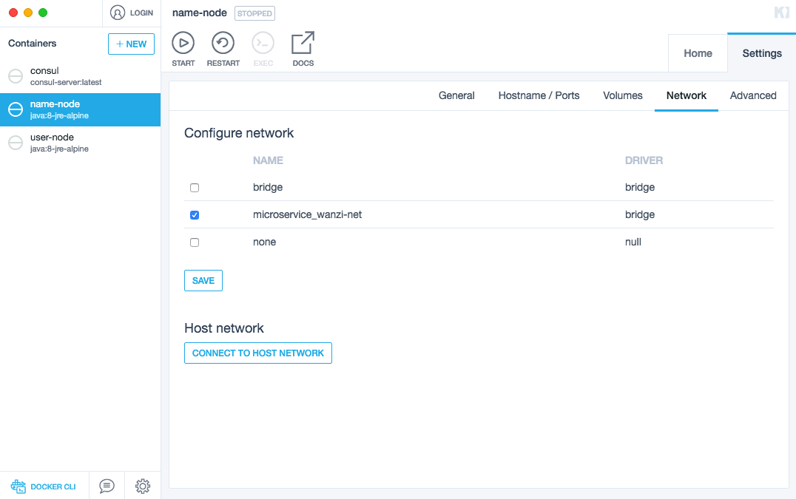

Spring Cloud Micro Service with Docker
--

## 本地环境
1. MacOS 10.12.4
2. Docker for Mac
3. Java8
4. Kitematic(Optional)

## 启动
1. 运行启动脚本
 `. ./up.sh` 或者`source ./up.sh`之后执行`.up.sh`
2. 访问consul ui
`http://localhost:8500/ui/`
3. 单独访问`name-service`和`user-service`

## NOTES
### Consul host
获取本机ip，将CONSUL_HOST设置为环境变量。
```bash
ipconfig getifaddr en0
```

### 网络
**Given**`consul-server`的networks为`service-net-1`和`service-net-2`<br>
**And**`name-service`的networks为`service-net-1`<br>
**And**`user-service`的networks为`service-net-2`<br>
**When** 启动up.sh时<br>
**Then**`consul-server`可以和`name-service`通信<br>
**And**`consul-server`可以和`user-service`通信<br>
**And**`name-servicer`**不**可以和`user-service`通信<br>
```yaml
version: '3'
services:
  user-service:
    image: java:8-jre-alpine
    container_name: user-node
    hostname: user-service
    working_dir: /user-service
    command: java -jar user-service-0.0.1-SNAPSHOT.jar
    ports:
      - "8503:8503"
    environment:
      - CONSUL_HOST=${CONSUL_HOST}
    volumes:
      - ./user-service/build/libs/:/user-service
    networks:
      - service-net-2
    depends_on:
      - name-service
    restart: always

  name-service:
    image: java:8-jre-alpine
    container_name: name-node
    hostname: name-service
    working_dir: /name-service
    command: java -jar name-service-0.0.1-SNAPSHOT.jar
    environment:
      - CONSUL_HOST=${CONSUL_HOST}
    volumes:
      - ./name-service/build/libs/:/name-service
    networks:
      - service-net-1
    ports:
      - "8502:8502"
    depends_on:
      - consul
    restart: always

  consul:
    image:  gliderlabs/consul-server:latest
    command: "-advertise=${CONSUL_HOST} -server -bootstrap"
    container_name: consul
    hostname: consul-server
    ports:
      - "8500:8500"
    networks:
      - service-net-1
      - service-net-2

networks:
  service-net-1:
  service-net-2:
```

### Kitematic
Kitematic 完全自动化了 Docker 安装和设置过程，并提供了一个直观的图形用户接口（GUI）来在 Mac 上运行 Docker。
