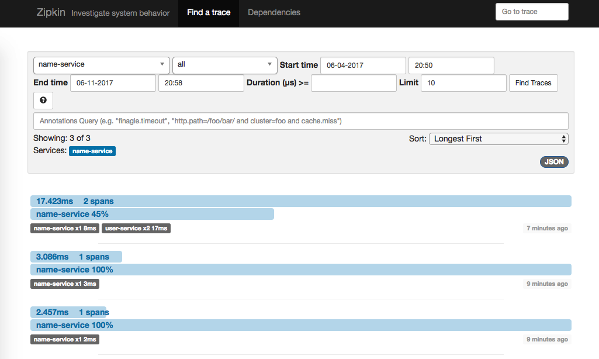
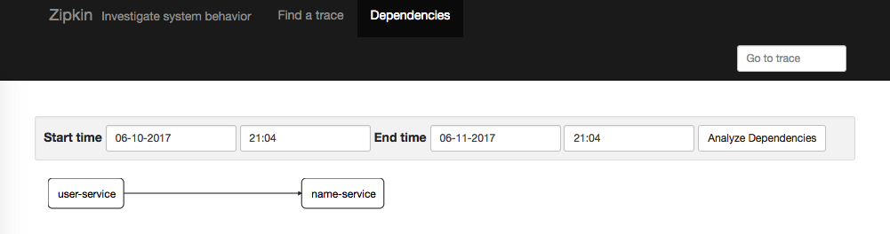
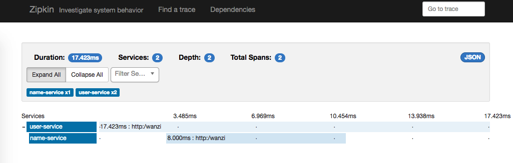
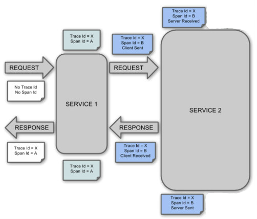
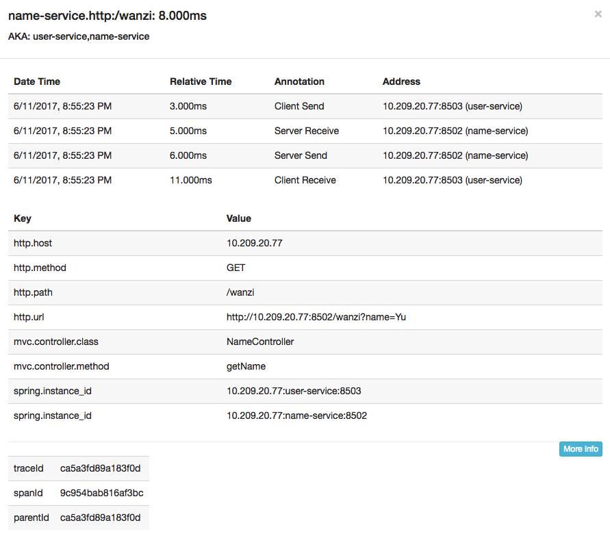

Spring Cloud Zipkin Demo
--

Spring Cloud Sleuth，日志收集工具包，封装了Dapper和log-based追踪以及*Zipkin*和HTrace操作，
为SpringCloud应用实现了一种分布式追踪解决方案。

## 启动
1. 启动`zipkin-server`
`./gradlew clean boorRun`
2. 访问`zipkin-server` UI
`http://localhost:9411/`
3. 启动`name-service`
4. 启动`user-service`
5. 访问`name-service`
`http://localhost:8502/wanzi?name=yu`
6. 访问`user-service`
`http://localhost:8503/wanzi?mobile=2345`
7. 查看zipkin server UI
* 可以看到所有的请求记录

* 可以看到服务间的调用关系

* 可以看到请求的顺序

## 术语：
1. Span
基本工作单元，例如，在一个新建的span中发送一个RPC等同于发送一个回应请求给RPC，span通过一个64位ID唯一标识，trace以另一个64位ID表示，span还有其他数据信息，
比如摘要、时间戳事件、关键值注释(tags)、span的ID、以及进度ID(通常是IP地址)
2. Trace
一系列spans组成的一个树状结构，例如，如果你正在跑一个分布式大数据工程，你可能需要创建一个trace。

3. Annotation
* Client Sent -客户端发起一个请求，这个annotion描述了这个span的开始
* Server Received -服务端获得请求并准备开始处理它，如果将其sr减去cs时间戳便可得到网络延迟
* Server Sent -注解表明请求处理的完成(当请求返回客户端)，如果ss减去sr时间戳便可得到服务端需要的处理请求时间
* Client Received -表明span的结束，客户端成功接收到服务端的回复，如果cr减去cs时间戳便可得到客户端从服务端获取回复的所有所需时间 

